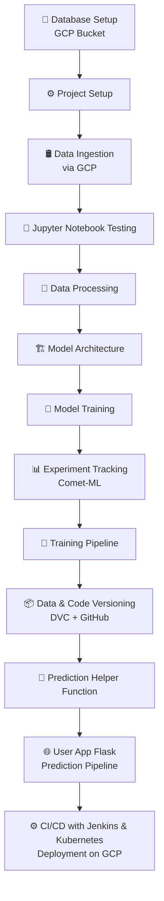

# 🎌 AniRec: Personalized Anime Recommendation System


AniRec is a full-scale end-to-end **Anime Recommendation System** that combines content-based filtering, collaborative filtering, and hybrid techniques. This project demonstrates the power of **MLOps**, incorporating tools like **Comet-ML**, **DVC**, **Jenkins**, **Docker**, and **Kubernetes** to deliver a scalable, reproducible, and production-grade recommendation system.

---

## 🚀 Key Features

- 🔍 **Content-Based Filtering** using genres and synopsis embeddings
- 👥 **Collaborative Filtering** using user-anime interaction embeddings
- 🤝 **Hybrid Recommender** that combines both strategies
- 📊 **Experiment Tracking** using **Comet-ML**
- 📦 **Data and Model Versioning** using **DVC**
- 🔧 **CI/CD Pipeline** using **Jenkins + Kubernetes**
- 🌐 **Web App Interface** using **Flask**

---

## 🧱 Project Architecture

---

## 🛠️ Project Workflow

### 1. 📦 Database Setup
- Centralized dataset storage using **Google Cloud Storage (GCP Bucket)**

### 2. ⚙️ Project Setup
- Structured codebase with modular components and dependencies

### 3. ☁️ Data Ingestion
- Loaded and validated datasets from GCP bucket

### 4. 📒 Jupyter Notebook Testing
- Prototyped recommender logic, EDA, embeddings, similarity scores

### 5. 🧹 Data Processing
- Cleaned anime metadata, extracted synopsis, encoded genres

### 6. 🧠 Model Architecture
- Developed content-based, collaborative, and hybrid models

### 7. 🎯 Model Training
- Optimized embedding and similarity models using rating data

### 8. 📊 Experiment Tracking
- Used **Comet-ML** for logging metrics, hyperparameters, and artifacts

### 9. 🔁 Training Pipeline
- Modular pipeline with reusable steps for ingestion → training → logging

### 10. 📦 Data & Code Versioning
- Used **DVC** to version datasets/models and **GitHub** for code

### 11. 🧩 Prediction Helper Functions
- Built modular functions for generating personalized recommendations

### 12. 🌐 User App with Prediction Pipeline
- Built using **Flask** to interface with the backend recommender

### 13. 🚀 CI/CD Deployment
- Containerized using **Docker**
- Deployed via **Kubernetes on GCP** using **Jenkins CI/CD**

---

## 🧰 Tech Stack

| Category              | Tools & Frameworks                                    |
|-----------------------|--------------------------------------------------------|
| Language              | Python                                                 |
| Data Storage          | GCP Bucket                                             |
| Web Framework         | Flask                                                  |
| Recommender Methods   | Collaborative Filtering, Content-Based, Hybrid        |
| Experiment Tracking   | Comet-ML                                               |
| Data Versioning       | DVC                                                    |
| Containerization      | Docker                                                 |
| Orchestration         | Kubernetes (Minikube / GKE)                            |
| CI/CD Pipeline        | Jenkins                                                |
| Deployment Platform   | Google Cloud Platform                                  |

---

## 🧪 Local Setup Instructions

```bash
# 1. Clone the repository
git clone https://github.com/your-username/anirec.git
cd anirec

# 2. Create virtual environment & activate
python -m venv venv
source venv/bin/activate  # for Linux/macOS
venv\Scripts\activate     # for Windows

# 3. Install dependencies
pip install -e .

# 4. Run the Flask app
python app.py

```
---
## 🌐 Run with Docker
```
# Build the Docker image
docker build -t anirec-app .

# Run the container
docker run -p 5000:5000 anirec-app

```


