# 🎬 AniRec: Personalized Anime Recommendation System
AniRec is a full-scale end-to-end **Anime Recommendation System** that combines content-based filtering, collaborative filtering, and hybrid techniques. This project demonstrates the power of **MLOps**, incorporating tools like **Comet-ML**, **DVC**, **Jenkins**, **Docker**, and **Kubernetes** to deliver a scalable, reproducible, and production-grade recommendation system.

---
## 📑 Table of Contents
* [🧱 Project Architecture](#-project-architecture)
* [🚀 Key Features](#-key-features)
* [🛠️ Project Workflow](#️-project-workflow)
  * [1. 📦 Database Setup](#1--database-setup)
  * [2. ⚙️ Project Setup](#2--project-setup)
  * [3. 📥 Data Ingestion](#3--data-ingestion-via-gcp-bucket)
  * [4. 📒 Jupyter Notebook Testing](#4--jupyter-notebook-testing)
  * [5. 🧹 Data Processing](#5--data-processing)
  * [6. 🧠 Model Architecture](#6--model-architecture)
  * [7. 🎯 Model Training](#7--model-training)
  * [8. 📊 Experiment Tracking](#8--experiment-tracking)
  * [9. 🔁 Training Pipeline](#9--training-pipeline)
  * [10. 📦 Data & Code Versioning](#10--data--code-versioning)
  * [11. 🧩 Prediction Helper Functions](#11--prediction-helper-functions)
  * [12. 🌐 User App with Prediction Pipeline](#12--user-app-with-prediction-pipeline)
  * [13. 🚀 CI/CD Deployment](#13--cicd-deployment)
* [🧰 Tech Stack](#-tech-stack)
* [🧪 Local Setup Instructions](#-local-setup-instructions)
* [🌐 Run with Docker](#-run-with-docker)
* [📸 Project Screenshots](#-project-screenshots)
* [📦 Future Improvements](#-future-improvements)
* [📚 Datasets](#-datasets)
* [📄 License](#-license)
* [🤝 Contributors](#-contributors)

---
## 🧱 Project Architecture

```mermaid
graph TD
    A[📂 Database Setup<br>GCP Bucket] --> B[⚙️ Project Setup]
    B --> C[🛢️ Data Ingestion<br>via GCP]
    C --> D[📓 Jupyter Notebook Testing]
    D --> E[🧹 Data Processing]
    E --> F[🏗️ Model Architecture]
    F --> G[🧠 Model Training]
    G --> H[📊 Experiment Tracking<br>Comet-ML]
    H --> I[🚀 Training Pipeline]
    I --> J[📦 Data & Code Versioning<br>DVC + GitHub]
    J --> K[🌐 User App Flask<br>Prediction Pipeline]
    K --> L[⚙️ CI/CD with Jenkins & Kubernetes<br>Deployment on GCP]

```

---

## 🚀 Key Features

- 🔍 **Content-Based Filtering** using genres and synopsis embeddings
- 👥 **Collaborative Filtering** using user-anime interaction embeddings
- 🤝 **Hybrid Recommender** that combines both strategies
- 📊 **Experiment Tracking** using **Comet-ML**
- 📦 **Data and Model Versioning** using **DVC**
- 🔧 **CI/CD Pipeline** using **Jenkins + Kubernetes**
- 🌐 **Web App Interface** using **Flask**

---

## 🛠️ Project Workflow

### 1. 📦 Database Setup
- Centralized dataset storage using **Google Cloud Storage (GCP Bucket)**

### 2. ⚙️ Project Setup
- Structured codebase with modular components and dependencies

### 3. 📥 Data Ingestion (via GCP Bucket) 
4. 📥 Data Ingestion  
- Fetched raw dataset files from a Google Cloud Storage bucket using the `google-cloud-storage` Python SDK.
     - Handled 3 CSV files: `anime.csv`, `anime_with_synopsis.csv`, and `animelist.csv`.
     - For the large `animelist.csv` (6M+ records), only the first 5 million rows were downloaded to optimize memory usage.
     - Created a structured ingestion class (`DataIngestion`) to automate downloading, saving, and logging each step.
     - Ensured idempotent design by creating required local folders (`RAW_DIR`) if not present.
     - Config-driven setup using a YAML file to load the bucket name and file list.

### 4. 📒 Jupyter Notebook Testing
- Conducted EDA, preprocessing, and recommendation logic development in notebooks.
- Tested multiple recommendation strategies:
    - Content-based filtering
    - Collaborative filtering
    - Hybrid approach

### 5. 🧹 Data Processing
- Preprocessed and transformed the ingested data to prepare it for collaborative filtering model training:
    - ✅ Loaded raw animelist.csv with selective columns: user_id, anime_id, and rating.
    - 👥 Filtered users with fewer than 400 ratings to reduce sparsity.
    - 📏 Scaled all ratings between 0 and 1 using Min-Max normalization.
    - 🔢 Encoded user_id and anime_id into integer indices for use with embedding layers.
    - 🔄 Shuffled and split data into training and testing sets (last 1000 for test).
    - 💾 Saved encoded mappings, training/testing arrays, and full rating DataFrame to disk using joblib.
    - 🧹 Cleaned anime metadata and synopsis data, handling missing values and saving curated files for downstream use.

### 6. 🧠 Model Architecture

- The recommendation engine is built using a neural collaborative filtering approach with dot-product interaction.
    - Built with TensorFlow/Keras using the Functional API.
    - Uses **embedding layers** for both users and anime to learn dense vector representations.
    - Performs a **dot product** between user and anime embeddings to capture interaction strength.
    - The architecture includes:
       - User Input → User Embedding
       - Anime Input → Anime Embedding
       - Dot Product → Flatten
       - Dense → BatchNorm → Sigmoid Activation
    - Output is a normalized score between 0 and 1, indicating the predicted user preference.
    - Compiled using parameters from `config.yaml`:
       - Loss: `binary_crossentropy`
       - Optimizer: `adam`
       - Metrics: `accuracy`

### 7. 🎯 Model Training  
- Trained a deep learning-based collaborative filtering model to learn user and anime embeddings using Keras:
    - 🧠 Model Architecture: Implemented a neural network using embedding layers for users and animes (BaseModel).
    - 📥 Data Input: Loaded preprocessed user-anime interaction data using joblib.
    - 🔁 Dynamic Learning Rate: Scheduled learning rate ramp-up and exponential decay for better convergence.
    - ⛔ Early Stopping: Prevented overfitting by stopping early when validation loss didn’t improve.
    - 💾 Checkpointing: Automatically saved the best weights using ModelCheckpoint.
    - 📊 Loss Tracking: Tracked training and validation loss across epochs.
    - 🔬 Evaluation: Evaluated model performance using final validation RMSE.
- 🌐 Comet-ML Integration:
    - Logged metrics like train/validation loss and final evaluation.
    - Uploaded final model and learned embeddings as assets.
    - Visualized training curves for monitoring.
- 📁 Artifacts Saved:
    - Final model (.h5)
    - User and Anime embedding matrices (normalized)
    - Training loss plot (PNG)

### 8. 📊 Experiment Tracking
- Used **Comet-ML** for logging metrics, hyperparameters, and artifacts

### 9. 🔁 Training Pipeline
- Modular training pipeline to automate:
   - Data loading and preprocessing
   - Model training and saving
   - Logging artifacts and metrics

### 10. 📦 Data & Code Versioning
- Used DVC (Data Version Control) to version datasets and models.
- Managed code versions and CI logs with GitHub.

### 11. 🧩 Prediction Helper Functions
- Built reusable prediction utilities to:
   - Recommend anime by user ID
   - Recommend similar anime by name
   - Combine content + collaborative recommendations

### 12. 🌐 User App with Prediction Pipeline
- Developed a Flask web application to:
   - Accept user inputs (user_id)
   - Display personalized recommendations with titles and genres
   - Call backend prediction functions via HTTP

### 13. 🚀 CI/CD Deployment
- Built production-ready pipeline using:
   - Jenkins for automated CI/CD
   - Docker for containerization
   - Kubernetes on GCP for scalable deployment

---

## 🧰 Tech Stack

| Category              | Tools & Frameworks                                    |
|-----------------------|--------------------------------------------------------|
| Language              | Python                                                 |
| Data Storage          | GCP Bucket                                             |
| Web Framework         | Flask                                                  |
| Recommender Methods   | Collaborative Filtering, Content-Based, Hybrid        |
| Experiment Tracking   | Comet-ML                                               |
| Data Versioning       | DVC                                                    |
| Containerization      | Docker                                                 |
| Orchestration         | Kubernetes (Minikube / GKE)                            |
| CI/CD Pipeline        | Jenkins                                                |
| Deployment Platform   | Google Cloud Platform                                  |

---

## 🧪 Local Setup Instructions

```bash
# 1. Clone the repository
git clone https://github.com/your-username/anirec.git
cd anirec

# 2. Create virtual environment & activate
python -m venv venv
source venv/bin/activate  # for Linux/macOS
venv\Scripts\activate     # for Windows

# 3. Install dependencies
pip install -e .

# 4. Run the Flask app
python app.py

```
---
## 🌐 Run with Docker
```
# Build the Docker image
docker build -t anirec-app .

# Run the container
docker run -p 5000:5000 anirec-app

```
---
## 📸 Project Screenshots

### 🚀 Jenkins CI/CD Pipeline Execution

<p float="left">
  
  
</p>

---

### ☁️ AniRec Web App Running on GCP

<p float="left">
  
</p>

---

### 🎨 AniRec Web App UI

<p float="left">
  
  
</p>

---

## 📦 Future Improvements
- Integrate user login and personalized dashboards.
- Incorporate NLP-based synopsis analysis for improved content similarity.
- Use embeddings from models like BERT or Sentence Transformers.
- Deploy with auto-scaling via GKE Ingress and HPA.

---
## 📚 Datasets
* [Anime Data](https://www.kaggle.com/datasets/hernan4444/anime-recommendation-database-2020)

## 📄 License
This project is licensed under the [MIT License](LICENSE).

---

## 🤝 Contributors
- [Dinesh Chaudhary](https://github.com/aimldinesh)
