# 🎬 AniRec: Personalized Anime Recommendation System
AniRec is a full-scale end-to-end **Anime Recommendation System** that combines content-based filtering, collaborative filtering, and hybrid techniques. This project demonstrates the power of **MLOps**, incorporating tools like **Comet-ML**, **DVC**, **Jenkins**, **Docker**, and **Kubernetes** to deliver a scalable, reproducible, and production-grade recommendation system.

---

## 🚀 Key Features

- 🔍 **Content-Based Filtering** using genres and synopsis embeddings
- 👥 **Collaborative Filtering** using user-anime interaction embeddings
- 🤝 **Hybrid Recommender** that combines both strategies
- 📊 **Experiment Tracking** using **Comet-ML**
- 📦 **Data and Model Versioning** using **DVC**
- 🔧 **CI/CD Pipeline** using **Jenkins + Kubernetes**
- 🌐 **Web App Interface** using **Flask**

---

## 🧱 Project Architecture

```mermaid
graph TD
    A[📂 Database Setup<br>GCP Bucket] --> B[⚙️ Project Setup]
    B --> C[🛢️ Data Ingestion<br>via GCP]
    C --> D[📓 Jupyter Notebook Testing]
    D --> E[🧹 Data Processing]
    E --> F[🏗️ Model Architecture]
    F --> G[🧠 Model Training]
    G --> H[📊 Experiment Tracking<br>Comet-ML]
    H --> I[🚀 Training Pipeline]
    I --> J[📦 Data & Code Versioning<br>DVC + GitHub]
    J --> K[🌐 User App Flask<br>Prediction Pipeline]
    K --> L[⚙️ CI/CD with Jenkins & Kubernetes<br>Deployment on GCP]

```

---

## 🛠️ Project Workflow

### 1. 📦 Database Setup
- Centralized dataset storage using **Google Cloud Storage (GCP Bucket)**

### 2. ⚙️ Project Setup
- Structured codebase with modular components and dependencies

### 3. 📥 DATA INGESTION (via GCP Bucket) 
- Raw datasets (`anime.csv`, `anime_with_synopsis.csv`, `animelist.csv`) stored in a Google Cloud Storage bucket.
- Ingested using Python scripts directly from GCS into the pipeline.

### 4. 📒 Jupyter Notebook Testing
- Conducted EDA, preprocessing, and recommendation logic development in notebooks.
- Tested multiple recommendation strategies:
    - Content-based filtering
    - Collaborative filtering
    - Hybrid approach

### 5. 🧹 Data Processing
- Cleaned anime metadata and user ratings.
- Merged multiple datasets (anime.csv, anime_with_synopsis.csv, animelist.csv).
- Extracted text features (synopsis) and encoded categorical features.

### 6. 🧠 Model Architecture
- Developed content-based, collaborative, and hybrid models

### 7. 🎯 Model Training
- Trained models to learn user preferences and anime embeddings.
- Optimized using metrics like RMSE and ranking-based evaluations.

### 8. 📊 Experiment Tracking
- Used **Comet-ML** for logging metrics, hyperparameters, and artifacts

### 9. 🔁 Training Pipeline
- Modular training pipeline to automate:
   - Data loading and preprocessing
   - Model training and saving
   - Logging artifacts and metrics

### 10. 📦 Data & Code Versioning
- Used DVC (Data Version Control) to version datasets and models.
- Managed code versions and CI logs with GitHub.

### 11. 🧩 Prediction Helper Functions
- Built reusable prediction utilities to:
   - Recommend anime by user ID
   - Recommend similar anime by name
   - Combine content + collaborative recommendations

### 12. 🌐 User App with Prediction Pipeline
- Developed a Flask web application to:
   - Accept user inputs (user_id)
   - Display personalized recommendations with titles and genres
   - Call backend prediction functions via HTTP

### 13. 🚀 CI/CD Deployment
- Built production-ready pipeline using:
   - Jenkins for automated CI/CD
   - Docker for containerization
   - Kubernetes on GCP for scalable deployment

---

## 🧰 Tech Stack

| Category              | Tools & Frameworks                                    |
|-----------------------|--------------------------------------------------------|
| Language              | Python                                                 |
| Data Storage          | GCP Bucket                                             |
| Web Framework         | Flask                                                  |
| Recommender Methods   | Collaborative Filtering, Content-Based, Hybrid        |
| Experiment Tracking   | Comet-ML                                               |
| Data Versioning       | DVC                                                    |
| Containerization      | Docker                                                 |
| Orchestration         | Kubernetes (Minikube / GKE)                            |
| CI/CD Pipeline        | Jenkins                                                |
| Deployment Platform   | Google Cloud Platform                                  |

---

## 🧪 Local Setup Instructions

```bash
# 1. Clone the repository
git clone https://github.com/your-username/anirec.git
cd anirec

# 2. Create virtual environment & activate
python -m venv venv
source venv/bin/activate  # for Linux/macOS
venv\Scripts\activate     # for Windows

# 3. Install dependencies
pip install -e .

# 4. Run the Flask app
python app.py

```
---
## 🌐 Run with Docker
```
# Build the Docker image
docker build -t anirec-app .

# Run the container
docker run -p 5000:5000 anirec-app

```
---
## 📸 Project Screenshots

### 🚀 Jenkins CI/CD Pipeline Execution

<p float="left">
  
  
</p>

---

### ☁️ AniRec Web App Running on GCP

<p float="left">
  
</p>

---

### 🎨 AniRec Web App UI

<p float="left">
  
  
</p>

---

## 📦 Future Improvements
- Integrate user login and personalized dashboards.
- Incorporate NLP-based synopsis analysis for improved content similarity.
- Use embeddings from models like BERT or Sentence Transformers.
- Deploy with auto-scaling via GKE Ingress and HPA.

