# 🎌 AniRec: Personalized Anime Recommendation System

AniRec is a full-scale end-to-end **Anime Recommendation System** that combines content-based filtering, collaborative filtering, and hybrid techniques. This project demonstrates the power of **MLOps**, incorporating tools like **Comet-ML**, **DVC**, **Jenkins**, **Docker**, and **Kubernetes** to deliver a scalable, reproducible, and production-grade recommendation system.

---

## 🚀 Key Features

- 🔍 **Content-Based Filtering** using genres and synopsis embeddings
- 👥 **Collaborative Filtering** using user-anime interaction embeddings
- 🤝 **Hybrid Recommender** that combines both strategies
- 📊 **Experiment Tracking** using **Comet-ML**
- 📦 **Data and Model Versioning** using **DVC**
- 🔧 **CI/CD Pipeline** using **Jenkins + Kubernetes**
- 🌐 **Web App Interface** using **Flask**

---

## 🧱 Project Architecture

```mermaid
graph TD
    A[📂 Database Setup<br>GCP Bucket] --> B[⚙️ Project Setup]
    B --> C[🛢️ Data Ingestion<br>via GCP]
    C --> D[📓 Jupyter Notebook Testing]
    D --> E[🧹 Data Processing]
    E --> F[🏗️ Model Architecture]
    F --> G[🧠 Model Training]
    G --> H[📊 Experiment Tracking<br>Comet-ML]
    H --> I[🚀 Training Pipeline]
    I --> J[📦 Data & Code Versioning<br>DVC + GitHub]
    J --> K[🧠 Prediction Helper Function]
    K --> L[🌐 User App Flask<br>Prediction Pipeline]
    L --> M[⚙️ CI/CD with Jenkins & Kubernetes<br>Deployment on GCP]



```

